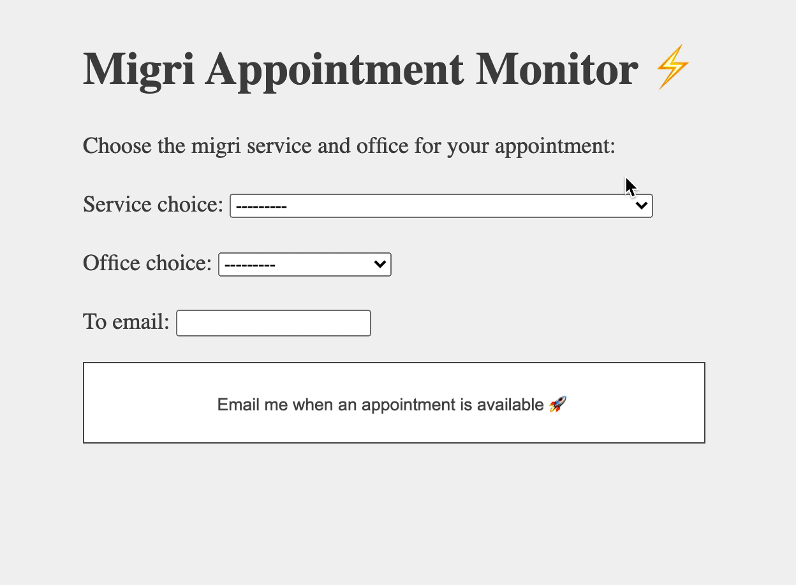

# appointment-monitor
App to monitor the nearest available appointment at migri every 10 minutes, and email the user with the available
appointment details.

You create monitoring requests:



Every 10 minutes, the app will scrape the migri booking page in the background:


## Contents
* [How to run](#how-to-run)
* [How to run tests and other dev tools](#how-to-run-tests-and-other-dev-tools)
* [Problem - Why do I need this?](#problem---why-do-i-need-this)
* [Solution](#solution)
* [App's basic flow](#apps-basic-flow)
* [Development methodologies](#development-methodologies)
* [Some thoughts](#some-thoughts)

## How to run
### Setting up
1. Install the [Chrome Driver](https://sites.google.com/a/chromium.org/chromedriver/downloads) which the project uses.
   Save the absolute path to wherever you install it.
1. Clone this repository then go to the root directory `appointment-monitor/`.
1. Run `pipenv install` to get all the project's requirements from Pipfile. To run `pipenv`, you need to have it
   installed on your machine.
1. Run `pipenv shell` to activate your virtual environment.
1. Create a `.env` file in the root directory to store environment variables.
1. Obtain a secret key from [MiniWebTool](https://miniwebtool.com/django-secret-key-generator/).
   Save it so you can add it to the `.env` file (as shown below).
1. Create an email account from which you want to receive notification emails. Better have a separate one from your
   personal email. This way, you can relax its security settings as you wish and let it be accessible by external apps.
1. Add other environment variables to your `.env` file, as shown below, so that it eventually looks like this:

     ```
     DRIVER_PATH="/absolute/path/to/chromedriver"
     BOOKING_SITE_URL="https://migri.vihta.com/public/migri/#/reservation"

     SECRET_KEY="secret_key_you_obtained_from_MiniWebTool"
     DEBUG=on

     FROM_EMAIL="address_of_email_from_which_you_want_to_receive_notification_emails"
     FROM_PASSWORD="password_of_that_account"
     ```

1. At the root directory, run `python manage.py migrate`.

### Running
From now on, all you need to do is go to the root directory of the project, then:
1. Activate your virtual environment by running `pipenv shell`.
1. Run the periodic task by running `python manage.py crontab add`.
1. Start the application by running `python manage.py runserver`.
1. Access the application on `http://127.0.0.1:8000/application/`.
1. Enjoy! 🎉

## How to run tests and other dev tools
To run the tests and use other dev-packages for various purposes like test coverage or flake8 reports, you need to run `pipenv install --dev`.
* Tests: run command `pytest` in the project root.
* Test coverage report: run `pytest --cov=application application/tests` in the project root.
* Flake8 reports: run `flake8` in the project root.
* Mypy for type checking: run `mypy application` in the project root.

## Problem - Why do I need this?
There was a time in my life in which I needed to keep on checking the appointment booking system in order to find a 
time slot for each of my residence permit and my citizenship applications.
Both required different appointment types that I had to search for.
It got time-consuming (and mentally taxing) when the appointments were scarce, and the calendar was showing
no appointments, except for in far-away cities.

## Solution
Build a bot to do the checking for me.
The bot uses:
- Selenium: to do the scraping and checking for available appointments.
- Django: to run server that takes monitoring requests containing the search parameters and email of the recipient.
- Cron: to run the task of checking the available appointments periodically.

## App's basic flow
`MonitoringRequest` objects instantiated and stored in DB.
Every 10 mins, do appointment monitoring (main task):
- Get all monitoring_request objects.
- Search for available appointments based on the attributes of each monitor.
- Email with the availability.

For a more detailed technical walkthrough, click
[here](https://github.com/sharbeldahlan/appointment-monitor/blob/master/application/README.md).

## Development methodologies
- Agile: Kanban. Check out the
  [project's kanban board](https://github.com/sharbeldahlan/appointment-monitor/projects/1).
- Documentation-driven development (DDD, for the love of acronyms).
- Test-driven Development (TDD).

## Some thoughts

<details>
    <summary>Advantages</summary>
    <ul>
        <li>
            In addition to the main advantage of not having to manually do the search: The app can set multiple monitoring
            requests of different types, such as residence permit and citizenship, and different emails to send to.
        </li>
    </ul>
</details>

<details>
    <summary>Limitations</summary>
    <ul>
        <li>
            This app does not do the booking, and this is by design. Letting the bot do the actual booking is both
            out of scope and adds <a href="#legal">legal</a> complexity.
        </li>
        <li>
            This is limited to the migri appointment page (vihta). Changes to rendered page might result in system not
            working. It would be better if there is an API to get all appointment data.
            The scraping depends on the structure of the output html on the appointment booking page.
        </li>
    </ul>
</details>

<details>
    <summary>Future improvements </summary>
    <ul>
        <li> For the user experience:
        <ul>
            <li> 
                Stop the notifications. Right now, you pull the plug 🔌: i.e. stop the server, 
                Later: delete monitoring requests or unsubscribe.
            </li>
        </ul>
        </li>
        <li>Nice-to-haves:
        <ul>
            <li> Show the past monitors or current monitors in progress.</li>
            <li> Show more than one available appointment at a time for options.</li>
        </ul>
        </li>
    </ul>
</details>

<details id="legal">
    <summary>Legal</summary>
    <ul>
        <li>
            This is under MIT License. It is intended for personal use, mostly for fun (and ease of mind) purposes.
            When you use it, do not book multiple appointments and try to sell them, because that is
            <a href="https://bit.ly/38dSrzT" target="_blank">illegal<a>.
        </li>
    </ul>
</details>
